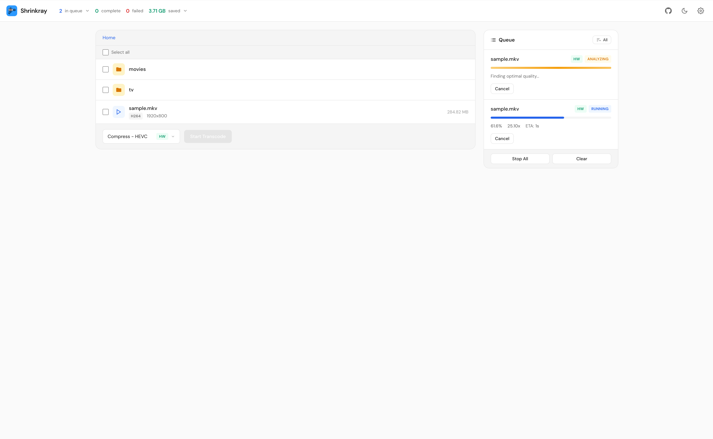

<div align="center">
  
  <h1>Shrinkray</h1>
  <p><strong>Simple, user-friendly video transcoding</strong></p>
  <p>Select a folder. Pick a preset. Shrink your media library.</p>

  
  
  
  
</div>

---

## What is Shrinkray?

Shrinkray is a user-friendly video transcoding tool designed to be simple from the ground up.

### Features

- **4 Smart Presets** — HEVC compress, AV1 compress, 1080p downscale, 720p downscale
- **Full GPU Pipeline** — Hardware decoding AND encoding with software fallback
- **HDR Support** — Automatic HDR detection with optional HDR-to-SDR tonemapping
- **Batch Selection** — Select entire folders to transcode whole seasons or libraries at once
- **Scheduling** — Restrict transcoding to specific hours (e.g., overnight only)
- **Quality Control** — Adjustable CRF for fine-tuned compression
- **Push Notifications** — Pushover alerts when your queue completes
- **Smart Skipping** — Automatically skips files already in target codec/resolution

---

## Screenshot

<div align="center">
  
  <p><em>Clean, focused interface: browse, select, transcode</em></p>
</div>

---

## Quick Start

### Unraid (Community Applications)

1. Search **"Shrinkray"** in Community Applications
2. Install and configure paths:
   - `/config` → Your appdata location
   - `/media` → Your media library
3. For GPU acceleration, pass through your GPU device (see [Hardware Acceleration](#hardware-acceleration))
4. Open the WebUI at port **8080**

### Docker Compose

```yaml
services:
  shrinkray:
    image: ghcr.io/gwlsn/shrinkray:latest
    container_name: shrinkray
    ports:
      - 8080:8080
    volumes:
      - /path/to/config:/config
      - /path/to/media:/media
      - /path/to/fast/storage:/temp  # Optional: SSD for temp files
    environment:
      - PUID=1000
      - PGID=1000
    restart: unless-stopped
```

### Docker CLI

```bash
docker run -d \
  --name shrinkray \
  -p 8080:8080 \
  -e PUID=1000 \
  -e PGID=1000 \
  -v /path/to/config:/config \
  -v /path/to/media:/media \
  ghcr.io/gwlsn/shrinkray:latest
```

---

## Presets

| Preset | Codec | Description | Theoretical Savings |
|--------|-------|-------------|-----------------|
| **Compress (HEVC)** | H.265 | Re-encode to HEVC | 40–60% smaller |
| **Compress (AV1)** | AV1 | Re-encode to AV1 | 50–70% smaller |
| **1080p** | HEVC | Downscale 4K → 1080p | 60–80% smaller |
| **720p** | HEVC | Downscale to 720p | 70–85% smaller |

By default (MKV output), audio and subtitles are copied unchanged. MP4 output mode converts audio to AAC stereo and strips subtitles for web compatibility.

---

## Hardware Acceleration

Shrinkray automatically detects and uses the best available hardware encoder. No configuration required, just pass through your GPU.

### Supported Hardware

| Platform | Requirements | Docker Flags |
|----------|--------------|--------------|
| **NVIDIA (NVENC)** | GTX 1050+ / RTX series | `--runtime=nvidia --gpus all` |
| **Intel (Quick Sync)** | 6th gen+ CPU or Arc GPU | `--device /dev/dri:/dev/dri` |
| **AMD (VAAPI)** | Polaris+ GPU on Linux | `--device /dev/dri:/dev/dri` |
| **Apple (VideoToolbox)** | Any Mac (M1+) | Native (no Docker needed) |

### Unraid GPU Passthrough

**NVIDIA:**
1. Install the **Nvidia-Driver** plugin from Community Applications
2. Add to container Extra Parameters: `--runtime=nvidia --gpus all`

**Intel / AMD:**
1. Add to container Extra Parameters: `--device /dev/dri:/dev/dri`

### Verifying Detection

Check the Shrinkray logs at startup to see which encoders were detected. The active encoder is marked with an asterisk. Each job in your queue displays an "HW" or "SW" badge indicating hardware or software encoding.

---

## Scheduling

Restrict transcoding to specific hours to reduce system load during the day.

1. Open **Settings** (gear icon)
2. Enable **Schedule transcoding**
3. Set start and end hours (e.g., 22:00 – 06:00 for overnight)

**Behavior:**
- Jobs can always be added to the queue
- Transcoding only runs during the allowed window
- Running jobs complete even if the window closes
- Jobs automatically resume when the window reopens

---

## HDR Support

Shrinkray automatically detects HDR content (HDR10, HLG, and 10-bit BT.2020) and displays an HDR badge on files and jobs.

### Tonemapping (HDR → SDR)

By default, HDR metadata is preserved during transcoding. If you need SDR output for compatibility:

1. Open **Settings** (gear icon)
2. Enable **Tonemap HDR to SDR**
3. Select an algorithm (hable is recommended)

**Note:** Tonemapping uses CPU-based filtering (zscale) but hardware encoding is still used for the actual encode. Expect slower processing compared to HDR passthrough.

### HDR Preservation

When tonemapping is disabled (default):
- 10-bit p010 pixel format is preserved
- BT.2020 color metadata is maintained
- HEVC Main10 profile is used automatically

---

## Configuration

Configuration is stored in `/config/shrinkray.yaml`. Most settings are available in the WebUI.

| Setting | Default | Description |
|---------|---------|-------------|
| `media_path` | `/media` | Root directory to browse |
| `temp_path` | *(empty)* | Fast storage for temp files (SSD recommended) |
| `original_handling` | `replace` | `replace` = delete original, `keep` = rename to `.old` |
| `workers` | `1` | Concurrent transcode jobs (1–6) |
| `quality_hevc` | `0` | CRF override for HEVC (0 = default, range: 15–40) |
| `quality_av1` | `0` | CRF override for AV1 (0 = default, range: 20–50) |
| `schedule_enabled` | `false` | Enable time-based scheduling |
| `schedule_start_hour` | `22` | Hour transcoding may start (0–23) |
| `schedule_end_hour` | `6` | Hour transcoding must stop (0–23) |
| `pushover_user_key` | *(empty)* | Pushover user key for notifications |
| `pushover_app_token` | *(empty)* | Pushover app token for notifications |
| `log_level` | `info` | Logging verbosity: `debug`, `info`, `warn`, `error` |
| `keep_larger_files` | `false` | Keep transcoded files even if larger than original |
| `output_format` | `mkv` | Output container: `mkv` (preserves all streams) or `mp4` (web compatible) |
| `tonemap_hdr` | `false` | Convert HDR content to SDR (uses CPU tonemapping) |
| `tonemap_algorithm` | `hable` | Tonemapping algorithm: `hable`, `bt2390`, `reinhard`, `mobius` |

### Example Configuration

```yaml
media_path: /media
temp_path: /tmp/shrinkray
original_handling: replace
workers: 2
quality_hevc: 24
schedule_enabled: true
schedule_start_hour: 22
schedule_end_hour: 6
log_level: info  # Use "debug" for troubleshooting
```

---

## Pushover Notifications

Get push notifications when your transcode queue completes.

1. Create an application at [pushover.net](https://pushover.net)
2. Copy your **User Key** and **API Token**
3. Enter both in Shrinkray → Settings
4. Enable **"Notify when done"** before starting jobs

Notifications include: completed/failed job counts, total space saved.

---

## Building from Source

```bash
# Clone the repository
git clone https://github.com/gwlsn/shrinkray.git
cd shrinkray

# Build
go build -o shrinkray ./cmd/shrinkray

# Run locally
./shrinkray -media /path/to/media

# Run tests
go test ./...
```

**Requirements:**
- Go 1.22+
- FFmpeg with HEVC/AV1 encoder support

---

## More Documentation

- [FAQ](docs/faq.md) - Common questions about CPU usage, skipped files, HDR, and more
- [FFmpeg Options Reference](docs/ffmpeg-options.md) - Detailed encoder settings and quality flags

---

## License

MIT License - see [LICENSE](LICENSE) for details.
