# Architecture overview

Shrinkray is a video transcoding application with a Go backend, embedded web UI, and FFmpeg for video processing.

## Core data flow

```mermaid
flowchart LR
    subgraph UI["Web UI"]
        B[Browser]
    end

    subgraph API["API Layer"]
        H[HTTP<br/>Handler]
        SSE[SSE<br/>Stream]
    end

    subgraph Core["Processing Core"]
        Q[(Job<br/>Queue)]
        W[Worker<br/>Pool]
    end

    subgraph Storage["Persistence"]
        DB[(SQLite)]
    end

    subgraph Transcode["FFmpeg"]
        FF[FFmpeg<br/>Process]
    end

    B -->|REST| H
    B <-->|Events| SSE
    H --> Q
    Q --> W
    W --> FF
    Q <--> DB
    SSE --> Q

    style UI fill:#1e3a5f,stroke:#4a9eff
    style API fill:#2d4a3e,stroke:#6bcf8e
    style Core fill:#4a3a5f,stroke:#b88aff
    style Storage fill:#5f3a3a,stroke:#ff8a8a
    style Transcode fill:#3a4a5f,stroke:#8ab4ff
```



**Request flow:**

1. User selects files in web UI and picks a preset
2. Browser POSTs to `/api/jobs` with file paths
3. Handler probes files with FFmpeg, adds jobs to queue
4. Workers pick up pending jobs and spawn FFmpeg processes
5. Progress updates flow back via SSE to update the UI
6. Completed jobs update SQLite and broadcast completion

## Package structure

```
shrinkray/
├── cmd/shrinkray/         # Entry point, CLI flags
├── internal/
│   ├── api/               # HTTP handlers, SSE streaming
│   ├── jobs/              # Job model, queue, worker pool
│   ├── ffmpeg/            # FFmpeg wrapper, hardware detection
│   │   └── vmaf/          # VMAF quality analysis for SmartShrink
│   ├── store/             # SQLite persistence
│   ├── config/            # YAML config loading
│   ├── browse/            # Directory browsing, file probing
│   ├── pushover/          # Push notifications
│   └── logger/            # Structured logging
└── web/                   # Embedded static assets (HTML/CSS/JS)
```

## Detailed documentation

- [Package responsibilities](packages.md) - What each package does
- [Job lifecycle](job-lifecycle.md) - How jobs flow through the system
- [Hardware acceleration](hardware.md) - Encoder detection and selection
