# Hardware acceleration

Shrinkray automatically detects and uses hardware encoders for faster transcoding.

## Detection flow

```mermaid
flowchart TB
    Start[Startup] --> Detect[Detect Encoders]

    Detect --> NVENC{Test NVENC}
    NVENC -->|Pass| NV_OK[NVENC available]
    NVENC -->|Fail| QSV{Test QSV}

    QSV -->|Pass| QSV_OK[QSV available]
    QSV -->|Fail| VAAPI{Test VAAPI}

    VAAPI -->|Pass| VA_OK[VAAPI available]
    VAAPI -->|Fail| VT{Test VideoToolbox}

    VT -->|Pass| VT_OK[VideoToolbox available]
    VT -->|Fail| SW[Software only]

    NV_OK --> Select
    QSV_OK --> Select
    VA_OK --> Select
    VT_OK --> Select
    SW --> Select

    Select[Select Best] --> Init[Initialize Presets]

    style Start fill:#3a4a5f,stroke:#8ab4ff
    style Detect fill:#3a4a5f,stroke:#8ab4ff
    style Select fill:#2d4a3e,stroke:#6bcf8e
    style Init fill:#2d4a3e,stroke:#6bcf8e
    style NV_OK fill:#2d4a3e,stroke:#6bcf8e
    style QSV_OK fill:#2d4a3e,stroke:#6bcf8e
    style VA_OK fill:#2d4a3e,stroke:#6bcf8e
    style VT_OK fill:#2d4a3e,stroke:#6bcf8e
    style SW fill:#5f4a3a,stroke:#ffb88a
```



Detection works by attempting a 1-frame test encode with each encoder. The first successful encoder in priority order is selected.

## Encoder priority

| Priority | Encoder | Platform | Why |
|----------|---------|----------|-----|
| 1 | NVENC | NVIDIA GPUs | Best quality/speed, wide support |
| 2 | Quick Sync | Intel CPUs | Good quality, low power |
| 3 | VAAPI | AMD/Intel Linux | Broad Linux support |
| 4 | VideoToolbox | macOS | Native Apple hardware |
| 5 | Software | All | Universal fallback |

## Full GPU pipeline

When hardware encoding is active, Shrinkray uses hardware decoding too:

```mermaid
flowchart LR
    subgraph GPU["GPU Memory"]
        HD[HW Decode] --> HE[HW Encode]
    end

    F[File] --> HD
    HE --> O[Output]

    style GPU fill:#2d4a3e,stroke:#6bcf8e
    style F fill:#3a4a5f,stroke:#8ab4ff
    style O fill:#3a4a5f,stroke:#8ab4ff
```



This keeps video frames in GPU memory, avoiding CPU-GPU transfers.

## Software decode fallback

Some scenarios require software decoding:

- Source codec not supported by hardware decoder
- HDR tonemapping enabled (requires CPU processing)
- Exotic codecs or profiles

```mermaid
flowchart LR
    subgraph CPU["CPU"]
        SD[SW Decode]
        TM[Tonemap]
    end

    subgraph GPU["GPU"]
        HE[HW Encode]
    end

    F[File] --> SD
    SD --> TM
    TM -->|upload| HE
    HE --> O[Output]

    style CPU fill:#5f4a3a,stroke:#ffb88a
    style GPU fill:#2d4a3e,stroke:#6bcf8e
```



Software decode + hardware encode still benefits from GPU encoding speed.

## Codec support

### HEVC encoding

| Encoder | FFmpeg Name | Quality Flag | GPU Requirement |
|---------|-------------|--------------|-----------------|
| Software | libx265 | `-crf` | None |
| NVENC | hevc_nvenc | `-cq` | GTX 1050+ |
| QSV | hevc_qsv | `-global_quality` | Intel 6th gen+ |
| VAAPI | hevc_vaapi | `-qp` | AMD Polaris+ |
| VideoToolbox | hevc_videotoolbox | `-b:v` | Any Mac |

### AV1 encoding

| Encoder | FFmpeg Name | Quality Flag | GPU Requirement |
|---------|-------------|--------------|-----------------|
| Software | libsvtav1 | `-crf` | None |
| NVENC | av1_nvenc | `-cq` | RTX 40 series |
| QSV | av1_qsv | `-global_quality` | Intel Arc |
| VAAPI | av1_vaapi | `-qp` | AMD RX 7000 |
| VideoToolbox | av1_videotoolbox | `-b:v` | M3+ |

AV1 hardware support is newer. Older GPUs fall back to software encoding for AV1 presets.

## Quality settings

Each encoder uses different quality parameters:

| Type | Flag | Range | Notes |
|------|------|-------|-------|
| CRF | `-crf` | 0-51 | Lower = higher quality |
| CQ | `-cq` | 0-51 | NVENC constant quality |
| QP | `-qp` | 0-51 | Fixed quantizer |
| Global Quality | `-global_quality` | 1-51 | Intel QSV |
| Bitrate | `-b:v` | kbps | VideoToolbox (calculated) |

Shrinkray normalizes these differences. When you set a CRF value in settings, it's translated to the appropriate parameter for your encoder.

## HDR handling

```mermaid
flowchart TB
    HDR{Is HDR?}

    HDR -->|No| Direct[Direct encode]
    HDR -->|Yes| TM_Enabled{Tonemap<br/>enabled?}

    TM_Enabled -->|No| Preserve[Preserve HDR<br/>Main10 profile]
    TM_Enabled -->|Yes| Tonemap[CPU tonemap<br/>to SDR]

    Preserve --> HW[HW Encode]
    Tonemap --> HW
    Direct --> HW

    style HDR fill:#4a3a5f,stroke:#b88aff
    style TM_Enabled fill:#4a3a5f,stroke:#b88aff
    style Preserve fill:#2d4a3e,stroke:#6bcf8e
    style Tonemap fill:#5f4a3a,stroke:#ffb88a
    style HW fill:#2d4a3e,stroke:#6bcf8e
    style Direct fill:#3a4a5f,stroke:#8ab4ff
```



- **HDR passthrough** (default): 10-bit Main10 profile, BT.2020 color space
- **Tonemapping**: CPU zscale filter, outputs 8-bit SDR

## Docker GPU passthrough

### NVIDIA

```yaml
services:
  shrinkray:
    runtime: nvidia
    environment:
      - NVIDIA_VISIBLE_DEVICES=all
```

Or with `--gpus all` flag.

### Intel/AMD

```yaml
services:
  shrinkray:
    devices:
      - /dev/dri:/dev/dri
```

The container user needs permission to access `/dev/dri` devices (usually `video` or `render` group).

## Troubleshooting

**No hardware encoder detected:**

1. Check GPU is passed through to container
2. Verify driver is installed
3. Check Shrinkray logs at startup for detection output

**Jobs show "SW" badge unexpectedly:**

1. Source codec may not be hardware-decodable
2. Tonemapping forces software decode
3. Check if AV1 preset fell back due to no AV1 HW support

**Intel QSV not working:**

1. Ensure `/dev/dri` is passed through
2. Set PUID/PGID matching host user
3. User must be in `video` or `render` group
