# Hardware acceleration

Shrinkray automatically detects and uses hardware encoders for faster transcoding.

## Detection flow

```mermaid
flowchart TB
    Start[Startup] --> Detect[Detect Encoders]

    Detect --> NVENC{Test NVENC}
    NVENC -->|Pass| NV_OK[NVENC available]
    NVENC -->|Fail| QSV{Test QSV}

    QSV -->|Pass| QSV_OK[QSV available]
    QSV -->|Fail| VAAPI{Test VAAPI}

    VAAPI -->|Pass| VA_OK[VAAPI available]
    VAAPI -->|Fail| VT{Test VideoToolbox}

    VT -->|Pass| VT_OK[VideoToolbox available]
    VT -->|Fail| SW[Software only]

    NV_OK --> Select
    QSV_OK --> Select
    VA_OK --> Select
    VT_OK --> Select
    SW --> Select

    Select[Select Best] --> Init[Initialize Presets]

    style Start fill:#3a4a5f,stroke:#8ab4ff
    style Detect fill:#3a4a5f,stroke:#8ab4ff
    style Select fill:#2d4a3e,stroke:#6bcf8e
    style Init fill:#2d4a3e,stroke:#6bcf8e
    style NV_OK fill:#2d4a3e,stroke:#6bcf8e
    style QSV_OK fill:#2d4a3e,stroke:#6bcf8e
    style VA_OK fill:#2d4a3e,stroke:#6bcf8e
    style VT_OK fill:#2d4a3e,stroke:#6bcf8e
    style SW fill:#5f4a3a,stroke:#ffb88a
```



Detection works by attempting a 1-frame test encode with each encoder. The first successful encoder in priority order is selected.

## Encoder fallback

If the primary encoder fails during a job (e.g., unsupported filter, driver issue), Shrinkray automatically retries with the next available encoder:

```mermaid
flowchart LR
    Start[Job Start] --> Primary[Try Primary Encoder]
    Primary -->|Success| Done[Complete]
    Primary -->|Fail| Fallback1[Try Next Encoder]
    Fallback1 -->|Success| Done
    Fallback1 -->|Fail| Fallback2[Try Software]
    Fallback2 -->|Success| Done
    Fallback2 -->|Fail| Failed[Job Failed]

    style Start fill:#3a4a5f,stroke:#8ab4ff
    style Done fill:#2d4a3e,stroke:#6bcf8e
    style Failed fill:#5f3a3a,stroke:#ff8a8a
    style Primary fill:#3a4a5f,stroke:#8ab4ff
    style Fallback1 fill:#5f4a3a,stroke:#ffb88a
    style Fallback2 fill:#5f4a3a,stroke:#ffb88a
```



Example fallback chain for Intel systems: Quick Sync → VAAPI → Software

This ensures jobs complete even when specific encoders fail on certain content. The fallback is per-job—subsequent jobs still attempt the primary encoder first.

## Encoder priority

| Priority | Encoder | Platform | Why |
|----------|---------|----------|-----|
| 1 | VideoToolbox | macOS | Native Apple hardware |
| 2 | NVENC | NVIDIA GPUs | Best quality/speed, wide support |
| 3 | Quick Sync | Intel CPUs | Good quality, low power |
| 4 | VAAPI | AMD/Intel Linux | Broad Linux support |
| 5 | Software | All | Universal fallback |

## Full GPU pipeline

When hardware encoding is active, Shrinkray uses hardware decoding too:

```mermaid
flowchart LR
    subgraph GPU["GPU Memory"]
        HD[HW Decode] --> HE[HW Encode]
    end

    F[File] --> HD
    HE --> O[Output]

    style GPU fill:#2d4a3e,stroke:#6bcf8e
    style F fill:#3a4a5f,stroke:#8ab4ff
    style O fill:#3a4a5f,stroke:#8ab4ff
```



This keeps video frames in GPU memory, avoiding CPU-GPU transfers.

## Software decode fallback

Some scenarios require software decoding:

- Source codec not supported by hardware decoder
- HDR tonemapping enabled (requires CPU processing)
- Exotic codecs or profiles

```mermaid
flowchart LR
    subgraph CPU["CPU"]
        SD[SW Decode]
        TM[Tonemap]
    end

    subgraph GPU["GPU"]
        HE[HW Encode]
    end

    F[File] --> SD
    SD --> TM
    TM -->|upload| HE
    HE --> O[Output]

    style CPU fill:#5f4a3a,stroke:#ffb88a
    style GPU fill:#2d4a3e,stroke:#6bcf8e
```



Software decode + hardware encode still benefits from GPU encoding speed.

## Codec support

### HEVC encoding

| Encoder | FFmpeg Name | Quality Flag | Default | Extra Args | GPU Requirement |
|---------|-------------|--------------|---------|------------|-----------------|
| Software | libx265 | `-crf` | 26 | `-preset medium` | None |
| NVENC | hevc_nvenc | `-cq` | 28 | `-preset p4 -tune hq -rc vbr` | GTX 1050+ |
| QSV | hevc_qsv | `-global_quality` | 27 | `-preset medium` | Intel 6th gen+ |
| VAAPI | hevc_vaapi | `-qp` | 27 | — | AMD Polaris+ |
| VideoToolbox | hevc_videotoolbox | `-b:v` | 35% of source | `-allow_sw 1` | Any Mac |

### AV1 encoding

| Encoder | FFmpeg Name | Quality Flag | Default | Extra Args | GPU Requirement |
|---------|-------------|--------------|---------|------------|-----------------|
| Software | libsvtav1 | `-crf` | 35 | `-preset 6` | None |
| NVENC | av1_nvenc | `-cq` | 32 | `-preset p4 -tune hq -rc vbr` | RTX 40 series |
| QSV | av1_qsv | `-global_quality` | 32 | `-preset medium` | Intel Arc |
| VAAPI | av1_vaapi | `-qp` | 32 | — | AMD RX 7000 |
| VideoToolbox | av1_videotoolbox | `-b:v` | 25% of source | `-allow_sw 1` | M3+ |

AV1 hardware support is newer. Older GPUs fall back to software encoding for AV1 presets.

> **Note:** VideoToolbox uses dynamic bitrate calculation. Target bitrate = source bitrate × modifier, clamped between 500 kbps and 15,000 kbps.

## Quality settings

Each encoder uses different quality parameters:

| Type | Flag | Range | Notes |
|------|------|-------|-------|
| CRF | `-crf` | 0-51 | Lower = higher quality |
| CQ | `-cq` | 0-51 | NVENC constant quality |
| QP | `-qp` | 0-51 | Fixed quantizer |
| Global Quality | `-global_quality` | 1-51 | Intel QSV |
| Bitrate | `-b:v` | kbps | VideoToolbox (calculated) |

Shrinkray normalizes these differences. When you set a CRF value in settings, it's translated to the appropriate parameter for your encoder.

### CRF to bitrate conversion (VideoToolbox)

VideoToolbox only supports bitrate-based encoding. CRF values are converted using:

```
modifier = 0.8 - (crf × 0.02)
```

| CRF | Bitrate Modifier | Typical Use |
|-----|------------------|-------------|
| 15 | 50% | Near-lossless |
| 22 | 36% | High quality |
| 26 | 28% | Default compress |
| 35 | 10% | Aggressive |

Modifiers are clamped to 5%-80% to prevent extreme values.

## Hardware initialization

Shrinkray auto-detects the best initialization method at startup. NVENC and QSV have two modes depending on the environment.

### NVENC (NVIDIA)

**Simple mode** (Docker/container environments):
```
-hwaccel cuda -hwaccel_output_format cuda
```

**Explicit mode** (bare metal with CUDA filters):
```
-init_hw_device cuda=cu:0 -filter_hw_device cu -hwaccel cuda -hwaccel_output_format cuda
```

### Quick Sync (Intel)

**Direct mode** (Docker/Unraid):
```
-init_hw_device qsv=qsv -filter_hw_device qsv -hwaccel qsv -hwaccel_output_format qsv
```

**VAAPI-derived mode** (bare metal Linux):
```
-init_hw_device vaapi=va:/dev/dri/renderD128 -init_hw_device qsv=qs@va -filter_hw_device qs -hwaccel qsv -hwaccel_output_format qsv
```

### VAAPI (Intel/AMD on Linux)

```
-init_hw_device vaapi=va:/dev/dri/renderD128 -filter_hw_device va -hwaccel vaapi -hwaccel_output_format vaapi
```

### VideoToolbox (macOS)

```
-hwaccel videotoolbox
```

## Filter chains

### Hardware upload (software decode → hardware encode)

| Platform | Filter |
|----------|--------|
| QSV | `format=nv12,hwupload=extra_hw_frames=64` |
| VAAPI | `format=nv12,hwupload` |
| NVENC | (auto-handles CPU frames) |
| VideoToolbox | (encoder handles CPU frames directly) |

### Base filters (full hardware pipeline)

| Platform | Base Filter |
|----------|-------------|
| NVENC | `scale_cuda=format=nv12` |
| QSV | `format=nv12\|qsv,hwupload=extra_hw_frames=64,scale_qsv=format=nv12` |
| VAAPI | `format=nv12\|vaapi,hwupload,scale_vaapi=format=nv12` |

### Scaling filters (1080p/720p presets)

| Platform | Scale Filter |
|----------|--------------|
| Software | `scale=-2:'min(ih,1080)'` |
| NVENC | `scale_cuda=-2:'min(ih,1080)'` |
| QSV | `scale_qsv=-2:'min(ih,1080)'` |
| VAAPI | `scale_vaapi=-2:'min(ih,1080)'` |
| VideoToolbox | `scale=-2:'min(ih,1080)'` (CPU) |

## HDR handling

```mermaid
flowchart TB
    HDR{Is HDR?}

    HDR -->|No| Direct[Direct encode]
    HDR -->|Yes| TM_Enabled{Tonemap<br/>enabled?}

    TM_Enabled -->|No| Preserve[Preserve HDR<br/>Main10 profile]
    TM_Enabled -->|Yes| Tonemap[CPU tonemap<br/>to SDR]

    Preserve --> HW[HW Encode]
    Tonemap --> HW
    Direct --> HW

    style HDR fill:#4a3a5f,stroke:#b88aff
    style TM_Enabled fill:#4a3a5f,stroke:#b88aff
    style Preserve fill:#2d4a3e,stroke:#6bcf8e
    style Tonemap fill:#5f4a3a,stroke:#ffb88a
    style HW fill:#2d4a3e,stroke:#6bcf8e
    style Direct fill:#3a4a5f,stroke:#8ab4ff
```



### HDR preservation (default)

When encoding HDR content without tonemapping:

- Uses `p010` pixel format (10-bit) instead of `nv12` (8-bit)
- Adds `-profile:v main10` for HEVC encoders
- Preserves HDR10 metadata:
  ```
  -color_primaries bt2020 -color_trc smpte2084 -colorspace bt2020nc
  ```

### Tonemapping (HDR to SDR)

Software tonemapping uses the zscale filter chain:

```
zscale=t=linear:npl=100,format=gbrpf32le,zscale=p=bt709,tonemap={algorithm}:desat=0:peak=100,zscale=t=bt709:m=bt709,format=yuv420p
```

Tonemapping always uses software decode, but encoding remains hardware-accelerated.

Available algorithms: `hable` (default), `bt2390`, `reinhard`, `mobius`, `clip`, `linear`, `gamma`

## Output format handling

### MKV (default)

Preserves all streams:
```
-map 0:v:0 -map 0:a? -map 0:s? -c:a copy -c:s copy
```

### MP4

Transcodes audio for web compatibility, strips subtitles (PGS breaks MP4):
```
-map 0:v:0 -map 0:a? -c:a aac -b:a 192k -ac 2 -sn
```

## Software decode triggers

Shrinkray proactively uses software decoding when hardware decode will fail:

| Condition | Reason |
|-----------|--------|
| H.264 High10 (4:2:0 10-bit) | No GPU supports this profile |
| VC-1 / WMV3 | Inconsistent hardware support |
| MPEG-4 Advanced Simple (DivX/XviD) | Not reliably supported |
| HDR tonemapping enabled | Requires CPU processing |

**Exception:** NVENC is allowed to attempt hardware decode for H.264 10-bit content because RTX 50 series supports H.264 High 4:2:2 (4:2:2 10-bit). If hardware decode fails, FFmpeg falls back at runtime.

The `RequiresSoftwareDecode()` function detects these before encoding starts, avoiding wasted time on failed hardware decode attempts.

## Docker GPU passthrough

### NVIDIA (standard Docker)

```yaml
services:
  shrinkray:
    runtime: nvidia
    environment:
      - NVIDIA_VISIBLE_DEVICES=all
      - NVIDIA_DRIVER_CAPABILITIES=all
```

Or with `--runtime=nvidia --gpus all` flags. Requires the [NVIDIA Container Toolkit](https://docs.nvidia.com/datacenter/cloud-native/container-toolkit/install-guide.html) on the host.

### Intel/AMD (standard Docker)

```yaml
services:
  shrinkray:
    devices:
      - /dev/dri:/dev/dri
    environment:
      - PGID=<render group GID>
```

The container user needs permission to access `/dev/dri` devices. Set PGID to the group that owns `/dev/dri/renderD128` on the host (check with `ls -la /dev/dri`).

### NVIDIA (Unraid)

Unraid requires the **Nvidia-Driver** plugin from Community Applications.

1. Install the Nvidia-Driver plugin and reboot
2. In the Docker template (Advanced View), add `--runtime=nvidia` to Extra Parameters
3. Add environment variable `NVIDIA_VISIBLE_DEVICES` = `all` (or a specific GPU UUID from the plugin page for multi-GPU systems)
4. Add environment variable `NVIDIA_DRIVER_CAPABILITIES` = `all`

If Docker won't start after adding `--runtime=nvidia`, restart Docker in Settings (disable, apply, enable, apply).

### Intel/AMD (Unraid)

1. Add `--device=/dev/dri` to Extra Parameters in the Docker template

The LinuxServer base image automatically handles device permissions inside the container.

## Troubleshooting

**No hardware encoder detected:**

1. Check GPU is passed through to container (`ls /dev/dri` inside container for Intel/AMD, `nvidia-smi` for NVIDIA)
2. Verify driver is installed on the host
3. Check PGID matches the render device group
4. Check Shrinkray logs at startup for detection output (use `log_level: debug` for full details)

**Jobs show "SW" badge unexpectedly:**

1. Source codec may not be hardware-decodable
2. Tonemapping forces software decode
3. Check if AV1 preset fell back due to no AV1 HW support

**Intel QSV not working:**

1. Ensure `/dev/dri/renderD128` is passed through (not just `/dev/dri`)
2. Set PGID to the group that owns the render device
3. On standard Linux, your user must be in both the `render` and `video` groups
