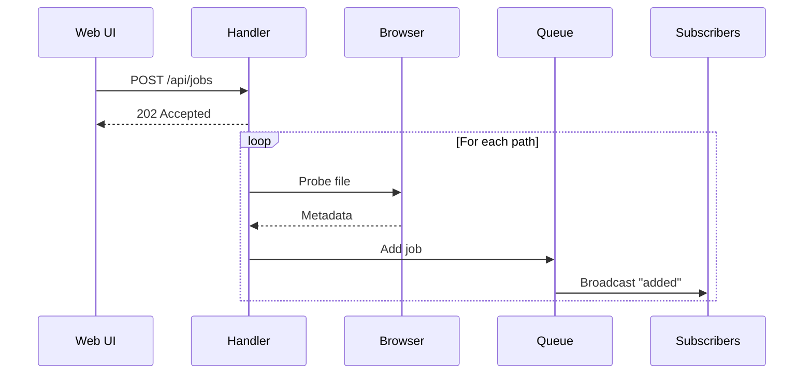
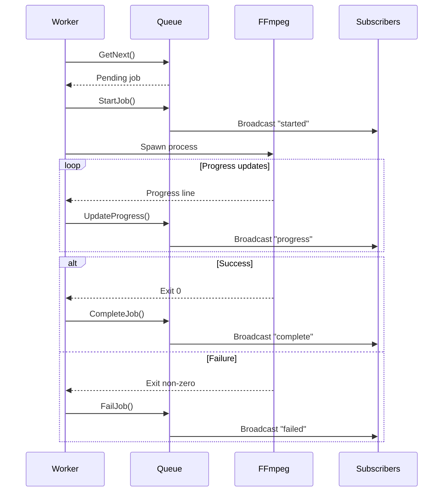
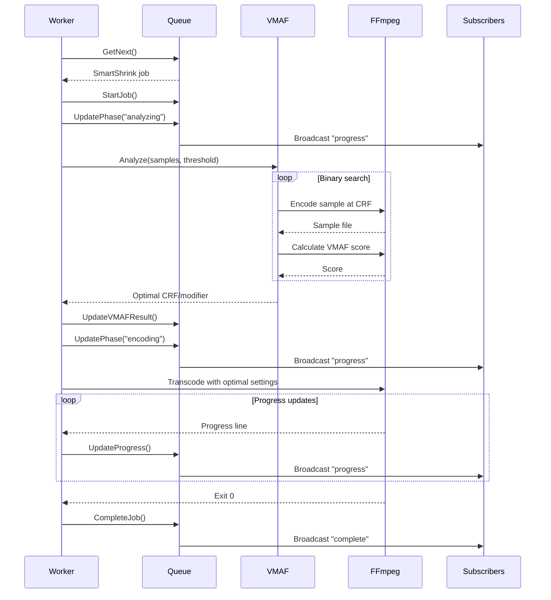

# Job lifecycle

Jobs flow through a defined set of states from creation to completion.

## State machine

```mermaid
stateDiagram-v2
    [*] --> pending: Job created
    pending --> running: Worker picks up
    pending --> cancelled: User cancels
    pending --> skipped: Already target codec

    running --> complete: Transcode success
    running --> failed: Transcode error
    running --> cancelled: User cancels
    running --> pending: Requeued (pause)

    complete --> [*]
    failed --> [*]
    cancelled --> [*]
    skipped --> [*]

    note right of pending: Waiting in queue
    note right of running: FFmpeg processing
    note right of skipped: Auto-skip:<br/>Already HEVC/AV1<br/>or target resolution
```

## Status descriptions

| Status | Description |
|--------|-------------|
| `pending` | Job is waiting in the queue for a worker |
| `running` | FFmpeg is actively transcoding |
| `complete` | Transcode finished successfully |
| `failed` | Transcode error (codec issue, disk full, etc.) |
| `cancelled` | User cancelled the job |
| `skipped` | Automatically skipped (file already meets criteria) |

## Creation flow



1. User selects files/folders and preset in UI
2. API responds immediately with 202
3. Background goroutine probes each file
4. Jobs added to queue with metadata
5. SSE broadcasts notify UI of new jobs

## Execution flow



## SmartShrink execution flow

SmartShrink jobs have an additional VMAF analysis phase before encoding:



The VMAF analysis phase:
1. Extracts 5 samples at fixed positions (10%, 30%, 50%, 70%, 90%)
2. Uses binary search to find optimal CRF/bitrate meeting the quality threshold
3. Scores use trimmed mean (drops highest/lowest) for stability
4. Analysis runs in parallel (limited by worker count)

## Skip logic

Jobs are automatically skipped when:

1. **Compression presets** (`compress-hevc`, `compress-av1`):
   - File is already encoded in target codec

2. **Downscale presets** (`1080p`, `720p`):
   - File height is already at or below target resolution

Skip checking happens at job creation time. Skipped jobs appear in the queue with status `skipped` and an explanation in the error field.

## Cancellation

Cancelling a running job:

1. Worker pool receives cancel request
2. FFmpeg process is killed (SIGKILL)
3. Temp file is deleted
4. Job status set to `cancelled`
5. SSE broadcasts cancellation

## Requeue (pause)

When the queue is paused:

1. Running jobs are interrupted
2. Jobs reset to `pending` status
3. Jobs moved to front of queue
4. Workers stop picking up new jobs

Resume allows workers to continue.

## Retry

Failed jobs can be retried:

1. Original file is re-probed
2. New job created with same preset
3. Failed job removed from queue
4. New job starts in `pending` state
